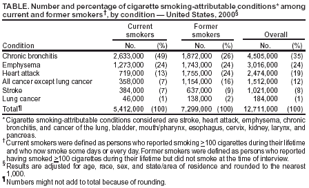

```{r, echo=FALSE, warning=FALSE, message=FALSE}
source("R/setup.rmd.R", local=TRUE)
setup.rmd(local.env=environment())
```
`r hl()$basefontsize()`
`r hl()$style()`

# Chapter 4: Descriptive Statistics

##  Categorical Data

#### **Case Study:** wrinccensus

Consider the variable Gender. Clearly this is categorical data. Usually the first thing one would do is simply count how many of each type there are:

```{r,warning=FALSE}
attach(wrinccensus) 
table(Gender)
```

#### **Case Study:** Race and Education

According to a table from the [US Department of Education](http://nces.ed.gov/programs/digest/d11/tables/dt11_237.asp) there were 19,980,000 students in US colleges in the fall of 2010. Their breakdown by race was as follows:
 
```{r, echo=FALSE}
race.table
```

If a table is used for presentation purposes it should usually include a little more information and maybe a better ordering, for example by size. Also, big numbers are often expressed in bigger units:

```{r, echo=FALSE}
x <- cbind(race.table, rep(0, 5))
x[, 1] <- x[, 1]/1000
x[, 2] <- round(x[, 1]/sum(x[, 1])*100, 1)
colnames(x) <- c("Number (in 1000)", "Percentage")
x <- x[c(5, 3, 4, 2, 1), ]
kable.nice(x, 15)
```

In order to compute the percentages we need to divide by the total and multiply by 100. The total is found using the sum command: 

```{r}
x <- c(12722, 3039, 2741, 1282, 196)
round(x/sum(x)*100,1)
```

Percentages are usually rounded to one digit behind the decimal, like above.

As we said before, some categorical variables have a built-in (natural) ordering, for example t-shirt size (small, medium, large, x-large) or grades (A,B, ...). Such an ordering can also be used.

#### **Case Study:** Satisfaction in WRInc

```{r}
attach(wrinccensus)
tbl <- table(Satisfaction)
tbl
perc <- round(tbl/sum(tbl)*100, 1)
perc
```


###  Graphs for Categorical Data

A very popular Choice: Pie Charts

**but**: 

[Death to Pie Charts] 
(http://www.storytellingwithdata.com/blog/2011/07/death-to-pie-charts)

Much better: **Bar charts**

#### **Case Study:** Race and Education

```{r}
barchart(race.table)
```


#### **Case Study:** WRInc


```{r}
barchart(Gender)
```

Sometime we want to change the ordering of the bars. We can do this with the *change.order* routine:

```{r}
barchart(change.order(Gender, new.order=2:1))
```

**Note**: to show the graph based on percentages use the argument percentage="grand":


```{r}
barchart(Gender, percentage = "grand")
```

#### **Case Study:** Race and Education

Let's do the graph based on percentages. Also let's change order of the bars from largest to smallest. Here we use the table as the argument to barchart, so we need to change the order in the table:

```{r}
race.table[c(5, 3, 4, 2, 1)]
```

so this puts things in the right order. 


```{r}
barchart(race.table[c(5, 3, 4, 2, 1)],
         percentage = "grand")
```


#### **Case Study:** WRInc

```{r}
attach(wrinccensus)
barchart(Job.Level)
barchart(change.order(Job.Level, 
                      c("7", "6", "5", "4", "3", "2", "1")), 
         percentage = "grand")
```

**Example** This is a nice professional table from the website of the CDC (Centers for Disease Control) about the dangers of smoking:




###  Totals (Frequencies) vs. Percentages

Decide based on the background of the data which number is more relevant/important/interesting. 

`r hl()$vspace()`

Some of the things to consider are:

If the data is a random sample from a larger population percentages are often better:

**Example** of 150 randomly selected people in a phone survey 85 said they would vote for candidate AA in the next election &rarr; use 57% instead. 

**Example** in a company with 150 employees 85 said they like their job &rarr;  use these numbers
  
For small numbers use frequencies, for large numbers use percentages.

When using percentages it has to be clear what the totals were:

**Example** an advertisement in the newspaper reads: "Almost 70% of the participants in a scientific study said they prefer Coke over Pepsi".

Now if this study had 1000 participants and about 700 of those said they like Coke better than Pepsi, that is quite impressive. On the other hand, if it had 3 participants, two of whom liked Coke ( 2 out of 3 = 67%, "almost" 70%) than this may not be so interesting! 

When comparing groups of unequal sizes, percentages are almost always necessary:

**Example** in a survey of the employees in a company they were asked whether they liked there current position:

```{r, echo=FALSE}
x <- matrix(c(123, 85, 88, 61), 2, 2)
dimnames(x) <- list(c("Male", "Female"), c("Yes", "No"))
knitr::kable(x)
```

At first glance it seems that men are happier with their position than women (123 vs 88) but notice that there are more men than women in total (208 vs 149) so even if they are equally happy we would expect more men who said yes then women. Changing to percentage gives

```{r, echo=FALSE}
x <- data.frame(Happy = c(59.1, 59.0))
rownames(x) <- c("Male", "Female")
knitr::kable(x)
```

Notice another advantage of the table with percentages: because there are only the two options yes and no, we need only the percentage of one, the other is simply 100-.. 

```{r, echo=FALSE}
x <- data.frame(Unappy = 100-c(59.1, 59.0))
rownames(x) <- c("Male", "Female")
knitr::kable(x)
```

and in general the smaller a table, the better (as long as it has all the information).

These are just guidelines, there can always be exceptions if there is a good reason.

###  Rounding

When doing a calculation the rule (generally) is to round to 1 digit more than the data. 

By default R always uses 7 digits:

```{r, echo=FALSE}
set.seed(112)
x<- round(sort(rnorm(11, 10, 3)), 1)
```

```{r}
x
mean(x)
```

and so you need to round this. The data has one digit behind the decimal, so you should have 2:

```{r}
round(mean(x), 2)
```


Many of the routines we use do some rounding already, usually to one digit behind the decimal:

```{r}
stat.table(x)
```
and you can use the ndigit argument to change how much:


```{r}
stat.table(x, ndigit=2)
```

Some examples:

```{r echo=FALSE}
x <- round(sort(rnorm(11, 100, 30)))
x
```

```{r}
stat.table(x, ndigit=1)
```

```{r echo=FALSE}
x <- round(sort(rnorm(11, 10, 3)), 3)
x
```

```{r}
stat.table(x, ndigit=4)
```

```{r echo=FALSE}
set.seed(111)
x <- round(sort(rnorm(11, 10000, 3000)), -2)
x
```

```{r}
stat.table(x, ndigit=-1)
```
**Special Cases:**

-  Percentages are usually rounded to one digit behind the decimal (34.8%)

-  probabilities and proportions are usually rounded to 3 digits (0.348)

###  Contingency Tables 

#### **Case Study:** Treatment of Drug Addiction

Cocaine addiction is hard to break. Addicts need cocaine to feel any pleasure, so perhaps giving them an antidepressant drug will help. A 3 year study with 72 chronic cocaine users compared an antidepressant called desipramine with standard treatment for cocaine addiction (lithium) and a placebo. One third of the subjects chosen at random received each drug. After 3 years for each addict it was determined whether he/she was drug free or relapsed. 

The data, from D.M. Barnes, "Breaking the Cycle of Addiction", Science, 241 1988).

```{r}
head(drugaddiction)
```

So here for each subject we have two variables, "Drug" with values "Desipramine", "Lithium" and "Placebo", and "Relapsed" with values "Yes" and "No". Both variables are categorical. 

Usually the first thing to do with this type of data is to just count each combination of values and write them up in a **contingency table**: 

```{r}
attach(drugaddiction)
table(Drug, Relapse)  
```

If the table is for publication you probably want to add some row and column totals: 

```{r, echo=FALSE}
x <- table(Drug, Relapse)
x <- cbind(x, apply(x, 1, sum))
x <- rbind(x, apply(x, 2, sum))
colnames(x)[3] <- "Totals"
rownames(x)[4] <- "Totals"
knitr::kable(x)
```

Often instead of the totals (frequencies) these tables might be based on percentages. Here, though, there are three types of percentages: 

**Percentages based on Grand Total**: 

```{r}
tbl <- table(Drug, Relapse)
round(tbl/sum(tbl)*100, 1)
```


```{r, echo=FALSE}
x1 <- round(100*x/sum(x[1:3, 1:2]), 1)
knitr::kable(x1)
```

**Percentages based on Row Totals**: 

```{r}
round(tbl/c(24, 24, 24)*100, 1)
```


```{r, echo=FALSE}
x1 <- round(100*x/apply(x[1:3, 1:2], 1, sum), 1)
x1[4, ] <- round(x1[4, ]/3,1)
knitr::kable(x1)
```

**Percentages based on Column Totals**: 

```{r}
round(tbl[, 1]/24*100, 1)
round(tbl[, 2]/48*100, 1)
```


```{r, echo=FALSE}
cls <- apply(x[1:3, 1:3], 2, sum)
x1 <- x
for(i in 1:3) x1[, i] <- round(100*x1[, i]/cls[i], 1)
knitr::kable(x1)
```

`r hl()$hr()`
Which of these 4 tables is the most interesting? It depends on the story behind the data and the result you wish to highlight. Here it is probably the third table which shows clearly that the "relapse rate" for desipramine is much smaller (41.7%) than for either Lithium (75%) or the Placebo (83.3%) 

#### **Case Study:** Treatment for Hair Loss, Rogaine

```{r}
attach(rogaine)
rog.tbl <- table(Growth, Group)
rog.tbl
```

-  percentages based on grand total:

```{r}
round(rog.tbl/sum(rog.tbl)*100, 1)
```


-  percentages based on row totals:

```{r}
clsum <- c(423+301, 150+172, 114+178, 29+58, 1+5)
clsum
round(rog.tbl/clsum*100, 1)
```
there is an easier way to do this:

```{r}
apply(rog.tbl, 1, sum)
```

-  percentages based on column totals:

```{r}
apply(rog.tbl, 2, sum)
round(rog.tbl[, 1]/717*100, 1)
round(rog.tbl[, 2]/714*100, 1)
```

`r hl()$hr()`

###  Graphs for Contigency Tabels

The standard graph for this data is a **multiple bar chart**. It is done with the same command as before.

There are always two depending on which way the bars are grouped together, see

```{r}
barchart(Drug, Relapse)
barchart(Relapse, Drug)
```

Again we can base everything on percentages:

```{r}
barchart(Drug, Relapse, percentage = "row")
barchart(Relapse, Drug, percentage = "col")
```


#### **Case Study:** Rogaine

```{r}
barchart(Growth, Group)
```

If we want to change the order of the bars we can again use 

```{r}
barchart(change.order(Growth, c(3, 5, 2, 1, 4)), 
        change.order(Group, 1:2),
        percentage = "row")
```

not that this makes much sense here!

#### **Case Study:** Drownings in Los Angeles

Data is from O'Carroll PW, Alkon E, Weiss B. Drowning mortality in Los Angeles County, 1976 to 1984, JAMA, 1988 Jul 15;260(3):380-3.

Drowning is the fourth leading cause of unintentional injury death in Los Angeles County. We examined data collected by the Los Angeles County Coroner's Office on drownings that occurred in the county from 1976 through 1984. There were 1587 drownings (1130 males and 457 females) during this nine-year period.

Let's do a barchart that shows the differences between the genders and drowning. Because there are many more men than women this has to be done with percentages:

```{r}
round(drownings[, "Male"]/sum(drownings[, "Male"])*100, 1)
round(drownings[, "Female"]/sum(drownings[, "Female"])*100, 1)
```

or with a barchart:

```{r}
barchart(drownings, percentage = "col")
```

